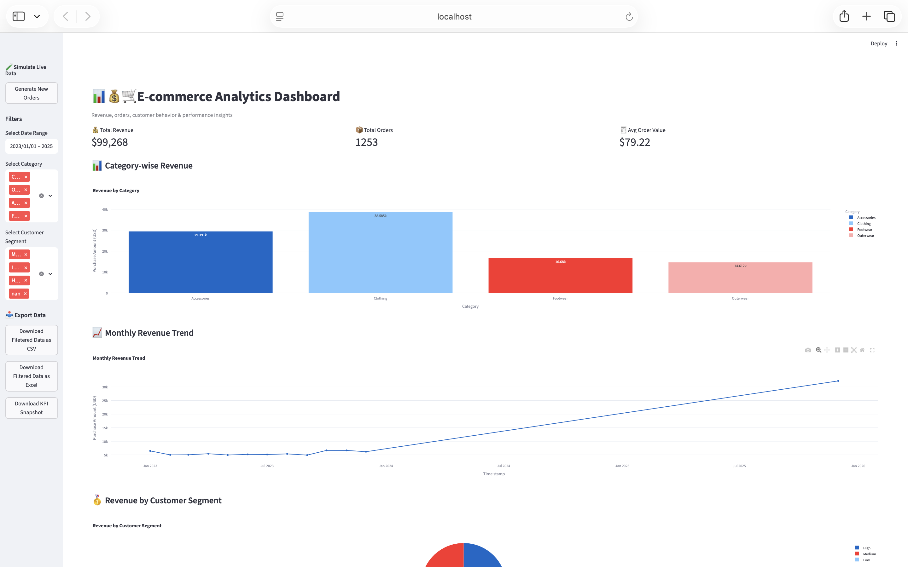
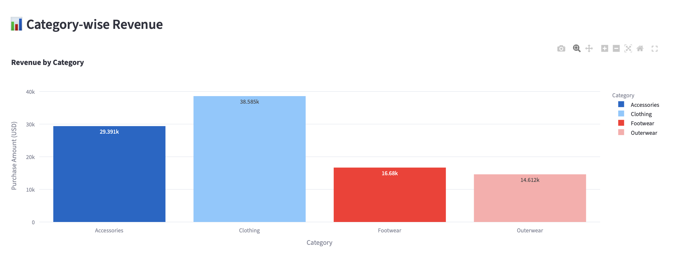
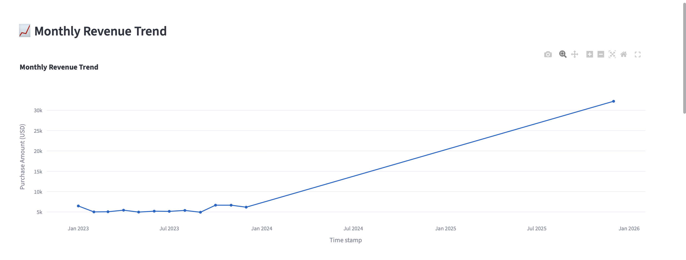
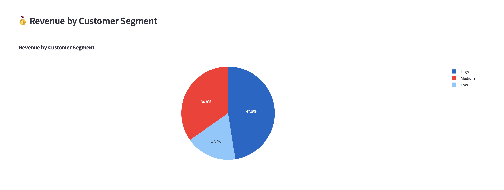
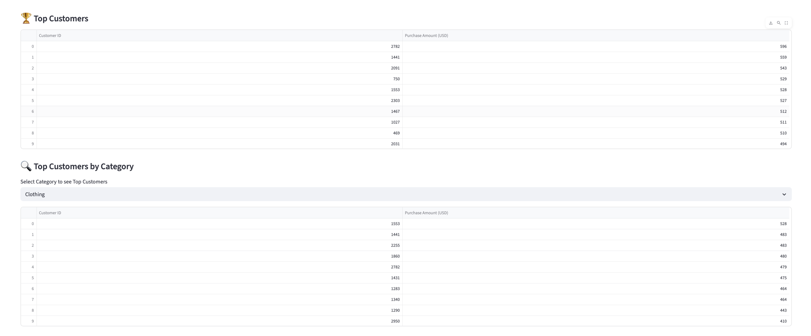
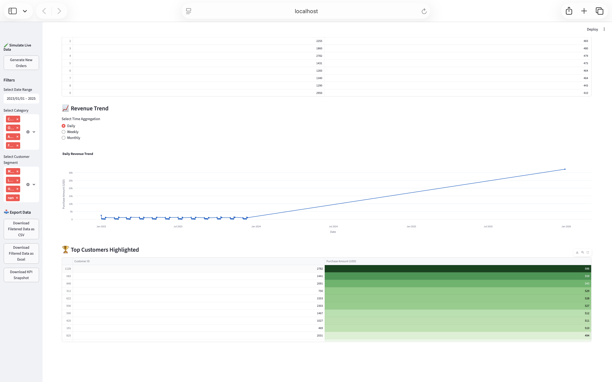
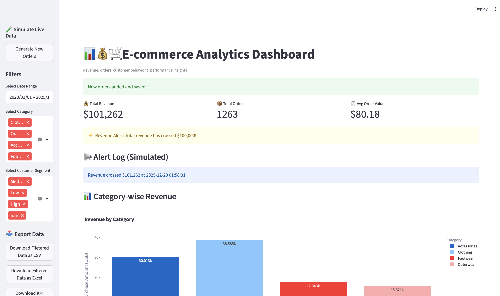

# 📊 Dynamic E-commerce Analytics Dashboard

 
 
 


> 
An interactive e-commerce analytics dashboard built with Python to track revenue, orders, customer behavior, and product performance with real-time KPI updates.

## 🚀 Project Overview

This project simulates a **real-world e-commerce analytics environment**, allowing users to:

- Monitor key business metrics in real time  
- Explore revenue trends across categories and customer segments  
- Drill down into top-performing customers  
- Generate simulated orders and persist data for continuous analysis  

**Built with:** Python, Streamlit, Plotly, and Pandas.

## ✨ Key Features

### 1️⃣ KPIs
- 💰 Total Revenue  
- 📦 Total Orders  
- 🧾 Average Order Value (AOV)  

### 2️⃣ Interactive Filters
- 🗓 Date Range  
- 🏷 Product Category  
- 👥 Customer Segment  

### 3️⃣ Visualizations
- 📊 Category-wise Revenue (Bar Chart)  
- 📈 Revenue Trends (Daily / Weekly / Monthly)  
- 🥧 Revenue by Customer Segment (Pie Chart)  
- 🏆 Top Customers with highlighted spending  

### 4️⃣ Data Simulation & Persistence
- 🧪 Generate random new orders for testing  
- 💾 Data is saved to `merged_df.csv` for continuity  

### 5️⃣ Alerts (Simulated)
- ⚡ Revenue threshold alerts with log display  
- ✉️ Email alert code included but commented out for security  

### 6️⃣ Data Export
- 📥 Download filtered data as CSV or Excel  
- 📊 Download KPI snapshot

## ⚡ How to Run the Dashboard

1. **Clone the repository**

```bash
git clone https://github.com/your-username/dynamic_ecommerce_dashboard.git
cd dynamic_ecommerce_dashboard

pip install -r requirements.txt

streamlit run dashboard.py
```
## 📸 Screenshots / Demo

### 1️⃣ Dashboard Overview
Shows the full dashboard with KPIs and filters at the top.


### 2️⃣ Category-wise Revenue
Bar chart showing revenue per product category.


### 3️⃣ Monthly Revenue Trend
Line chart showing revenue trends over time (daily, weekly, monthly).


### 4️⃣ Revenue by Customer Segment
Pie chart showing revenue contribution from different customer segments.


### 5️⃣ Top Customers Table
Table highlighting top 10 customers by revenue, with gradient highlighting for better visibility.


### 6️⃣ Drill-Down Feature
Shows the top customers for a selected category (interactive feature).


### 7️⃣ Alerts (Simulated)
Shows the revenue alert message when revenue crosses a threshold.


## 📝 Notes

- `merged_df.csv` contains sample merged data for immediate dashboard display  
- Email alert functionality is included but commented out; requires Gmail app password  
- Dashboard auto-refreshes every 30 seconds for real-time simulation  

## 🛠️ Technologies Used

- Python 3.x  
- Streamlit  
- Pandas  
- Plotly  
- Matplotlib  
- XlsxWriter  

## 👩‍💻 Author

**Divya Dangi** – [GitHub Profile](https://github.com/00Divya)  

## 📌 License

This project is licensed under the MIT License.